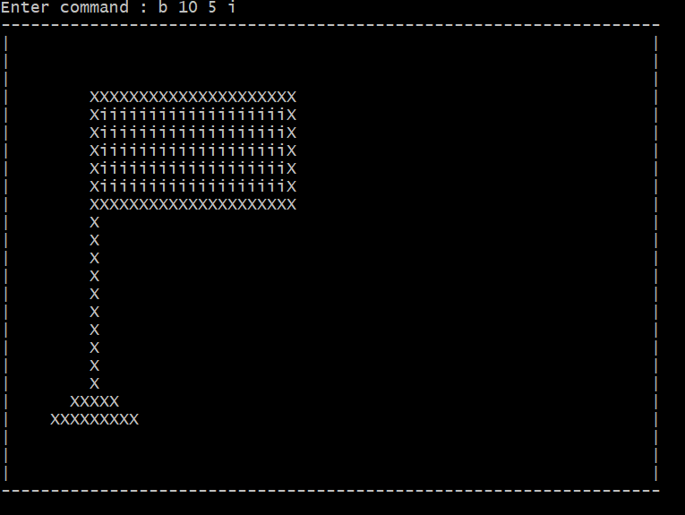
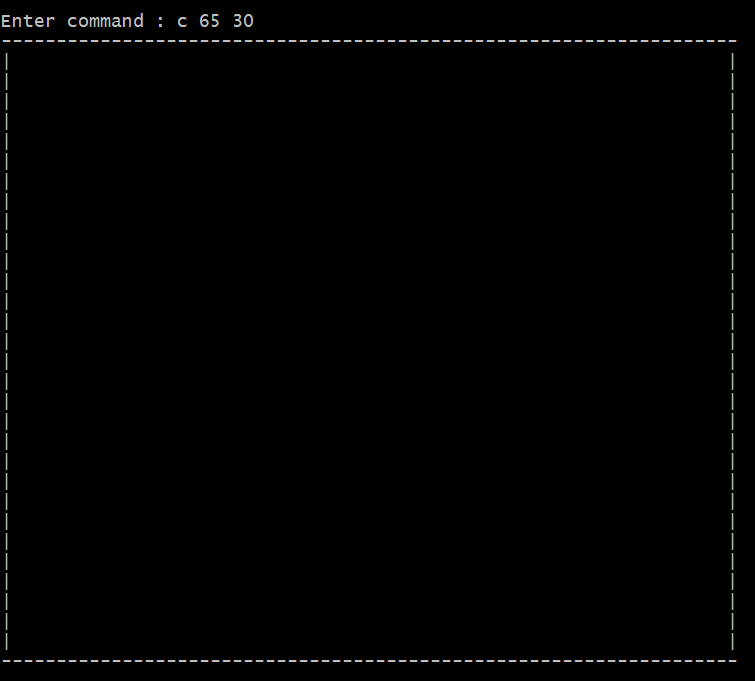
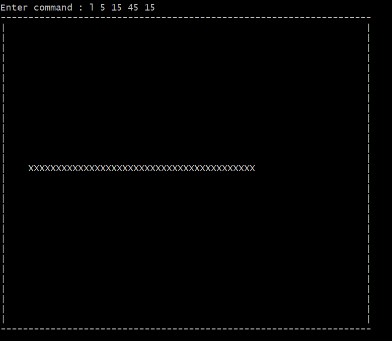
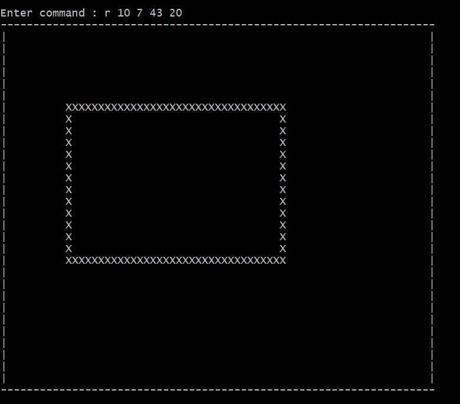
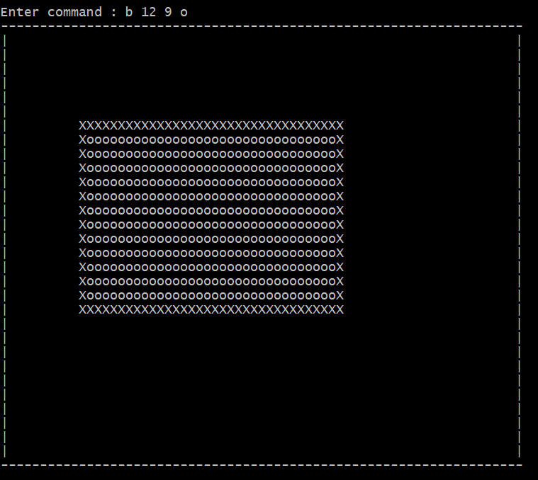
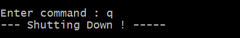

# Canvas App 
A Java application to enable drawing on the console using command line inputs.
Create a canvas of desired size, draw & color using console commands.

# Tech-stack
- Java 8
- Spring 5.1.5
- Mockito + JUnit
- Log4j
- Maven

# Valid Inputs
- __C w h__ : Should create a new canvas of width w and height h.

- __L x1 y1 x2 y2__ : Should create a new line from _(x1,y1)_ to _(x2,y2)_. Currently only horizontal or vertical lines are - supported. Horizontal and vertical lines will be drawn using the 'x' character.

- __R x1 y1 x2 y2__ : Should create a new rectangle, whose upper left corner is _(x1,y1)_ and lower right corner is _(x2,y2)_. Horizontal and vertical lines will be drawn using the 'x' character.

- __B x y c__ : Should fill the entire area connected to (x,y) with "colour" c. The behaviour of this is the same as that of the "bucket fill" tool in paint programs.

- __Q__ : Should quit the program.

# Build / Installation
- uber JAR: java -jar canvas-app-1.0-SNAPSHOT-jar-with-dependencies.jar
- Create new jar: mvn clean install